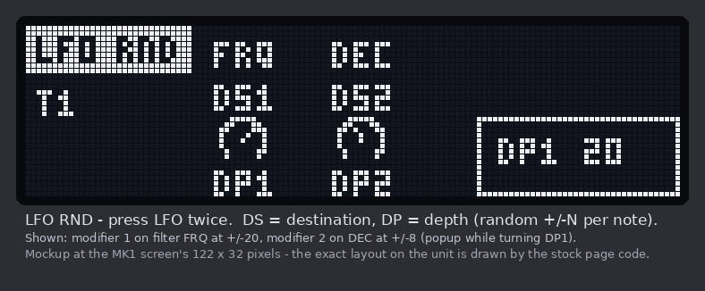
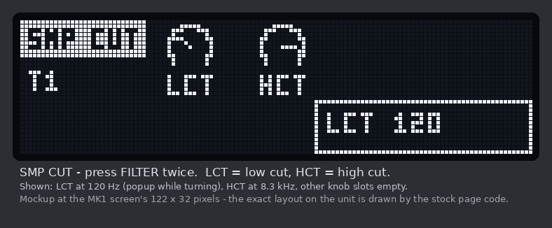

# User manual - Analog Rytm MK1

What each mod in the MK1 build does on the device and how to use it. For building
see `README.md`, for installing `docs/FLASHING.md`, and read `docs/HAZARDS.md`
before flashing.

There are two builds. Both are stock MK1 OS 1.73 plus the mods below; everything
not mentioned behaves as stock, and the unit still reports OS 1.73.

| build | mods |
|---|---|
| `AR1_OS1.73_0000_0002_0003_0008.syx` (SMP CUT) | 0002, 0003, 0008 |
| `AR1_OS1.73_0000_0002_0003_0004.syx` (RANDOM) | 0002, 0003, 0004 |

0004 and 0008 keep their settings in the same spare word of each sound, so they
can't be in one build. Pick the one you need; switching is a normal OS update, and
sounds keep their data - but the word is read by whichever mod is running, so a
sound set up for one reads as (arbitrary) settings of the other. Reset them on the
page when you switch.

| mod | where | what |
|---|---|---|
| 0002 | TRIG > euclidean page, OP | euclid sets accents on your trigs instead of placing trigs |
| 0003 | TRIG page, FUNC + VEL | per-track random velocity |
| 0004 | LFO key, pressed twice (RANDOM build) | LFO RND page: two random modifiers per sound |
| 0008 | FILTER key, pressed twice (SMP CUT build) | SMP CUT page: low cut and high cut per track |

0000 is the shared code the others call into. It has no controls.

Status on MK1: **built and verified in software, not yet run on an MK1.** 0002,
0003 and 0004 were confirmed on an MKII by the author of the original project; 0008
is new; the MK1 port has been checked address by address against the MK1 image
(PORTING.md), but only hardware can confirm it. The MKII compressor preview (0006)
is not ported.

MK1-specific: the MK1 draws the Bool Operator glyphs smaller (13 x 11 pixels
instead of 17 x 12), and the accent versions are made from the MK1's own glyphs
with a 2 x 2 dot in the top-right corner.

## 0002 - Euclidean accents

Normally the euclidean generator decides which steps play. With this mod it can
instead leave the pattern's trigs alone and mark some of them with ACCENT: the
grid says when, euclid says which hits are accented.

**Use.** On the euclidean page, the Bool Operator (OP) now has eight values instead
of four:

| value | icon | behaviour |
|---|---|---|
| OR, XOR, AND, SUB | stock gate glyph | stock euclidean |
| OR\*, XOR\*, AND\*, SUB\* | the same glyph with a small dot, top right | accent mode, same operator |

In accent mode:

- Only steps with a trig in the grid play. Euclid adds nothing.
- A trig on a step where the euclidean pattern has a hit plays accented.
- Accents you set by hand stay; euclid only ever adds accent.
- Turning euclid off with FUNC held bakes the result: the accents are written
  into the pattern. Turning it off without FUNC leaves the pattern as it was,
  as stock does.

The setting is per track and survives save, power cycle and reload.

**On stock firmware** a pattern saved with an accent-mode track loads with euclid
off on that track.

## 0003 - Velocity humanise

Adds a random offset to the velocity of every trig on a track.

**Use.** On the TRIG page, hold FUNC and turn the VEL knob. While FUNC is held
the label reads RND and the knob selects the amount N:

    0, 1, 2, 3, 4, 6, 8, 10, 12, 16, 20, 24, 32, 40, 48, 64

The sixteen settings sit on evenly spaced positions of the knob. Each trig then
plays at its velocity plus a random amount between -N and +N, kept within
1..127. Release FUNC and VEL behaves as stock. N = 0 is off.

The amount is per track and stored with the pattern. It needs 0002, which saves
it; the two are always built together.

**Limitations**

- Editing the amount may not mark the project as modified, so the device may
  not prompt you to save. Save explicitly.

## 0004 - LFO RND (RANDOM build)

A second LFO page with two random modifiers per sound. On every note trig each
modifier picks a random offset for its destination parameter and holds it until
the next note. Unlike SMP CUT this changes the parameter values themselves, so it
works on the analog side too: filter, decay, pitch, the machine's own parameters.

**Use.** Press the LFO page key a second time for LFO RND; press it again to
return to LFO.

| knob | label | setting |
|---|---|---|
| A | DS1 | modifier 1 destination |
| B | DS2 | modifier 2 destination |
| E | DP1 | modifier 1 depth |
| F | DP2 | modifier 2 depth |

A destination knob shows the parameter's short name instead of a dial. Turning it
opens the destination list, as LFO DST does, but on the left of the screen. Pick
with the knob, confirm with YES. The list holds sixteen destinations:

- the eight machine parameters (SRC page), which follow the machine
- FIN, STA (sample)
- FRQ, RES (filter)
- DEC, PAN (amp)
- DEL, REV (sends)

A depth knob selects N from the same sixteen settings as 0003 (0 to 64). Each
note trig offsets the destination by a random amount between -N and +N, clamped
to the parameter's range. The offset is added on top of the parameter's value,
p-locks, slides and LFO 1. Depth 0 is off.

The four settings belong to the sound: they are meant to be saved with the kit and
to travel with the sound through copy/paste and the sound pool (on MK1 not yet
checked on hardware - the checklist asks). Sounds made before the mod read the
first destination at depth 0.

**Limitations**

- Voice tracks only; the FX track has no LFO RND.
- The four settings cannot be p-locked.
- After the sequencer stops, the last offsets stay applied until the next note.
  You may hear this on ringing notes and on pads.
- Pads get no randomisation until the pattern has played at least once.
- A step that plays a sound from the pool (sound lock) uses the kit sound's
  settings.
- A destination is stored as a machine slot. After a machine change it points at
  the same slot on the new machine; where that slot is empty the knob reads `--`
  and the empty slot does not appear in the list.
- Edits may not mark the project as modified. Save explicitly.

## 0008 - SMP CUT (low cut / high cut, SMP CUT build)

A second FILTER page for cleaning up a mix: a low cut and a high cut on each
track's **sample**.

**Use.** Press FILTER, then FILTER again: the page is SMP CUT. Press FILTER again to
go back.

| knob | label | what |
|---|---|---|
| A | LCT | low cut (removes lows): OFF at 0, then 20 Hz .. 20 kHz |
| B | HCT | high cut (removes highs): 20 Hz .. 20 kHz, OFF at 127 |

Turning a knob shows the cutoff in the popup ("120", "1.2k", "OFF"). Both are
12 dB/octave (Butterworth). The range is 64 steps, about 2 semitones each, spread
evenly in pitch. Set LCT above HCT and you get a band-pass.

The settings are per track, stored in the track's sound, and take effect as you
turn the knob.

**What it filters, and what it cannot.** On the Rytm the filter, amp and mixer are
analog. What the firmware can reach is each voice's *digital* layer - the sample,
and the digital noise some machines add - which it sends through a DAC into the
voice's analog path, before the analog filter. SMP CUT filters that. The analog
synthesis part of a machine is not affected. On a sample-only track (machine off,
or its level at 0) it acts on the whole sound.

**Things to know**

- A full-scale sample with a strong low cut can clip slightly: the filter's
  overshoot is clamped at full scale.
- Tracks that share a voice (RS/CP, MT/HT, CH/OH, CY/CB) use the settings of whichever
  track played last on that voice.
- Settings follow the sound instantly: a kit or project load, a sound from the
  pool, copy/paste - the audio side reads each track's sound every block.
- A filter only costs processor time while its voice is actually sounding (plus a
  short tail): a silent voice is detected and skipped. With both filters on, the
  two run as one fused pass. While sounding, each filter costs roughly 1% of the
  audio interrupt's time by instruction count. To MEASURE it, flash the measuring
  build (2_builds/..._diag.syx): hold FUNC and turn LCT - the popup shows the
  filters' peak share of the audio interrupt since you last looked (e.g. "2.4%").
  In that build the LCT/HCT popups otherwise work as normal.
- **Not yet verified: that the settings survive saving the kit and a power cycle.**
  They live in the sound's one unused parameter slot; whether the MK1 saves that
  slot has to be tested on the unit.
- Parameter locks are not supported for LCT/HCT.
- It cannot be in the same build as LFO RND (0004): both use that same slot. That
  is why there is a separate RANDOM build.
